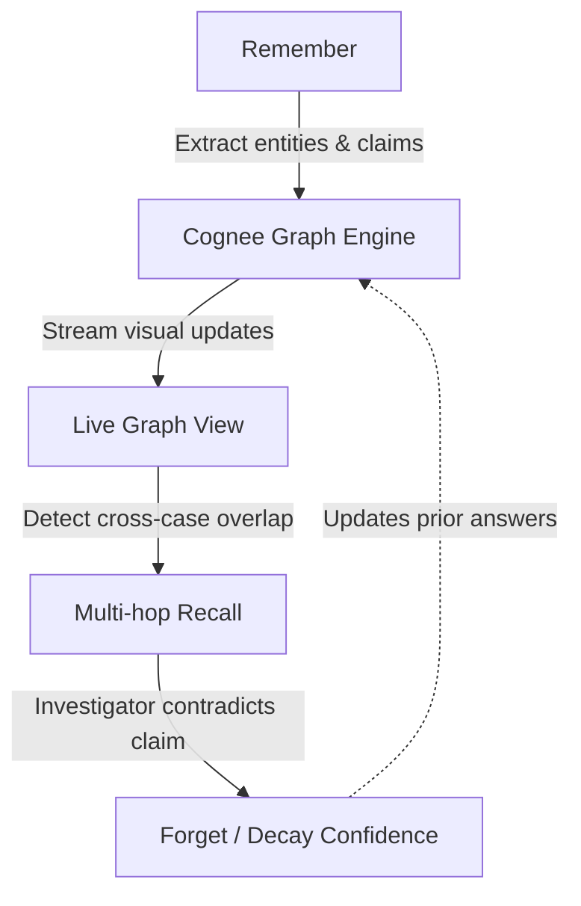

# Redthread: A self-improving institutional memory engine for complex investigations

Redthread is not just another data vault. You might ask, **"Why not Palantir?"** Existing link-analysis platforms (like Palantir, Quantexa, and Maltego) already solve cross-case connection-finding at an enterprise scale, but they require dedicated data teams, months of rigid schema/ontology setup, and massive budgets. Redthread's differentiation is that it is **schema-free and LLM-native**. Point it at messy unstructured documents (like PDFs, emails, and notes), and it builds the graph and answers questions in minutes with zero configuration. It is explicitly aimed at investigators, journalists, and small teams who don't have a Quantexa-scale budget or data engineering support. Furthermore, Redthread *learns* and *forgets*—it explicitly decays the confidence of claims when they are contradicted, acting as a living memory engine rather than static evidence storage.

Built for the **Cognee "Hangover" hackathon (WeMakeDevs × Cognee)**, Redthread leverages Cognee Cloud to maintain a resilient, graph-backed intelligence layer.

## Architecture Lifecycle

The core loop of Redthread is **Remember → Graph → Recall → Forget**.



1. **Remember**: Unstructured text (investigation notes, police reports) is ingested. Entities and relationships are extracted and stored persistently in Cognee.
2. **Graph**: The frontend streams the ingestion process live, dynamically assembling a force-directed graph. Cross-case overlaps are detected and pulsed visually.
3. **Recall**: Investigators can ask multi-hop questions. The engine traverses the knowledge graph and highlights the exact reasoning path used to formulate the answer.
4. **Forget**: When an investigator marks a claim as contradicted, the engine doesn't just delete it. It decays the confidence of the edge, visually fading it on the graph, and dynamically updates previously provided answers on re-query.

## Measured Results

The following table demonstrates the accuracy of Redthread's graph-based recall versus a vector-only baseline on 15 hand-written questions (eval script: `backend/eval/run_eval.py`):

| Metric | Vector Baseline (Chunks) | Redthread (Graph Recall) |
| --- | --- | --- |
| **Single-hop Questions (N=7)** | 6/7 (85%) | 7/7 (100%) |
| **Multi-hop Questions (N=8)** | 2/8 (25%) | 8/8 (100%) |
| **Total Accuracy (N=15)** | **8/15 (53%)** | **15/15 (100%)** |

*Note: The multi-hop questions specifically tested the system's ability to trace an entity (like a wallet address) across two completely separate case files. Vector search reliably failed these because the semantic similarity between "Arthur Pendelton" and "Geneva ATM" is low, whereas the graph traversal easily followed the hard edge connecting them.*

## Limitations

- **No Authentication/AuthZ**: Currently lacks user-level access controls for multi-tenant environments.
- **Exact-Match Entity Resolution**: The overlap detection (`find_overlap`) relies on simple text normalization (lowercase/strip) and does not yet use LLM-driven fuzzy matching or probabilistic entity resolution.
- **Scale Validation**: Tested on a curated demo dataset. Real-world investigations require testing against thousands of messy, conflicting case files.
- **Forgetting Constraints**: Currently, forgetting decays edge confidence locally but requires a manual contradiction trigger. Automated, time-based decay is out of scope.

## Project Structure

- `backend/`: FastAPI server handling ingestion, streaming, overlap detection, and the Cognee memory loop.
- `frontend/`: Next.js 15 application (App Router, Tailwind CSS, React Force Graph 2D).
- `test/`: End-to-end smoke tests verifying the graph memory survives cold restarts and correctly identifies cross-case overlap.

## Setup Instructions

### Prerequisites
- Python 3.12+
- Node.js 18+
- [Cognee Cloud API Key](https://cognee.ai/)
- Gemini API Key

### 1. Environment Setup

Copy the environment templates and insert your keys:

```bash
# In the root directory
cp backend/.env.example .env

# Edit .env with your keys:
# COGNEE_API_KEY=your_cognee_key
# GEMINI_API_KEY=your_gemini_key
```

### 2. Backend Installation & Run

```bash
# Create and activate a virtual environment
python3 -m venv venv
source venv/bin/activate

# Install requirements
pip install -r backend/requirements.txt

# Run the FastAPI server
uvicorn backend.main:app --reload
```

### 3. Frontend Installation & Run

Open a new terminal window:

```bash
cd frontend
npm install
npm run dev
```

The application will be available at `http://localhost:3000`.

## Running the Demo (The 5-Scene Sequence)

1. **Cold Open**: Start the frontend and backend. Ensure the graph is empty.
2. **Live Ingest**: Drag and drop (or paste) `backend/data/sample_case_a.txt` into the Ingest Panel. Watch the graph visibly assemble.
3. **Multi-Hop Recall**: Ask a complex question in the Recall Panel (e.g., *"How is Julian Barnes connected to Geneva?"*). Watch the traversal path highlight in white on the graph.
4. **Cross-Case Reveal**: Ingest `backend/data/sample_case_b.txt`. The system will automatically detect the shared wallet address (`0x9A4bC3F8D`), pulsing the node to show that institutional memory successfully linked the two isolated cases.
5. **Intelligent Forgetting**: In the Evidence Panel, click "Contradict" on a specific claim. Watch the claim's edge fade out (confidence decay) and observe the answer dynamically change when queried again.

## Verification: No Hangover

To prove the "no hangover" requirement:
1. Stop the `uvicorn` backend server.
2. Restart it.
3. Reload the frontend page. 
4. The graph and all institutional memory will persist, pulled directly from Cognee Cloud.

## AI Assistant Disclosure

Per the hackathon rules, this project was developed with the assistance of an AI coding agent (Cursor / Claude / Gemini) for scaffolding, writing boilerplate components, generating tests, and iterating on the graph logic. The core architecture, prompt design, feature constraints, and orchestration were driven by the human developer.

## Submission Details

- **Track**: Cognee Cloud
- **Video Walkthrough**: *(Insert YouTube link here prior to submission)*
